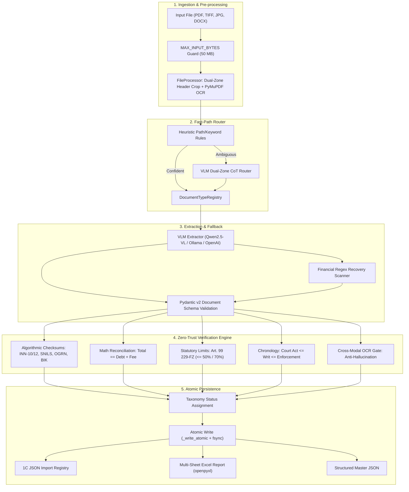

[English](ARCHITECTURE.md) | [Русский](ARCHITECTURE_RU.md)

# Architecture and Status Taxonomy

## 1. System Mission and Boundaries
`ScanReader` is an in-process document recognition, Zero-Trust verification, and data orchestration library designed for legal technology pipelines, accounting systems (such as 1C:Enterprise), and autonomous AI agents.

The system does **not** assume neural model outputs are ground truth. Instead, it operates on a **Zero-Trust paradigm**:
- Fast-Path multimodal visual classification routes documents to domain plugins;
- Specialized VLM extraction gathers structured fields according to strict Pydantic v2 schemas;
- An independent, deterministic **Zero-Trust Verification Engine** independently validates mathematical reconciliations, Russian statutory checksums (INN, SNILS, OGRN, BIK), temporal chronology, and cross-modal presence in the OCR layer;
- Atomic file operations ensure safe persistence and prevent corrupted output artifacts.

---

## 2. Verification Status Taxonomy

ScanReader reports clear, unambiguous statuses without false mathematical claims:

| Status | Code | Meaning & Guarantees |
| :--- | :--- | :--- |
| **`zero_trust_verified`** | `ZT_VERIFIED` | 100% corroborated: arithmetic matches ($\text{debt} + \text{fee} = \text{total}$), all check digits (INN, SNILS, OGRN) match, dates are chronologically consistent, and entities appear in OCR. Ready for automated unassisted import. |
| **`vlm_unverified`** | `VLM_UNVERIFIED` | Fields extracted and schema-valid, but no checksums or line-item breakdowns exist in the source document. Exported with an advisory verification flag. |
| **`heuristic_fallback`** | `HEURISTIC_FALLBACK` | Neural model produced broken JSON or timed out; deterministic regex fallback extracted monetary amounts and identifiers. |
| **`discrepancy_detected`** | `DISCREPANCY_ERROR` | A mathematical conflict, check digit mismatch, or statutory limit violation (e.g. deduction $> 70\%$) was detected. Quarantined for human review. |
| **`ocr_low_confidence`** | `OCR_POOR_QUALITY` | Scan is illegible, corrupted, or low resolution ($< 150 \text{ DPI}$ or OCR confidence $< 0.6$). |
| **`rejected_unsupported`** | `UNSUPPORTED_TYPE` | Document does not belong to any recognized legal execution or court order category. |

---

## 3. Component Pipeline Architecture

---

## 4. Model Context Protocol (MCP) Interface

The `scan_reader.mcp` module implements standard JSON-RPC 2.0 / MCP Stdio tools:
- `scan_document`: Complete multimodal parsing and Zero-Trust verification.
- `classify_document`: Fast-Path document routing.
- `verify_legal_data`: Standalone algorithmic auditing of JSON structures.
- `run_benchmark`: Evaluation suite against ground truth datasets.
- `export_results`: Consolidation into Excel and 1C import registries.

All tools enforce `MAX_INPUT_BYTES = 50 MB` and automatically mask secrets from logs.
