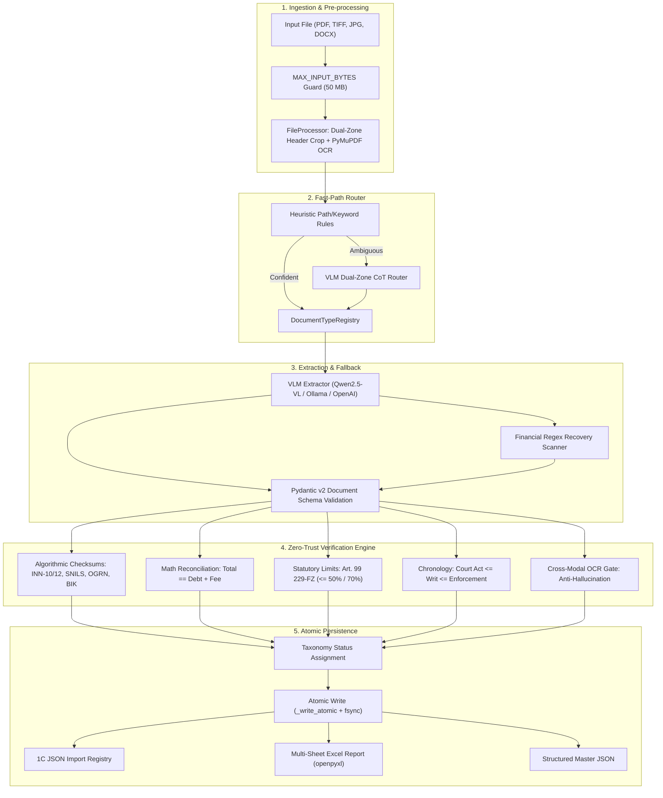

[English](ARCHITECTURE.md) | [Русский](ARCHITECTURE_RU.md)

# Architecture and Status Taxonomy

## 1. System Mission and Boundaries
`ScanReader` is an in-process document recognition, Zero-Trust verification, and data orchestration library designed for legal technology pipelines, accounting systems (such as 1C:Enterprise), and autonomous AI agents.

The system does **not** assume neural model outputs are ground truth. Instead, it operates on a **Zero-Trust paradigm**:
- Fast-Path multimodal visual classification routes documents to domain plugins;
- Specialized VLM extraction gathers structured fields according to strict Pydantic v2 schemas;
- An independent, deterministic **Zero-Trust Verification Engine** independently validates mathematical reconciliations, Russian statutory checksums (INN, SNILS, OGRN, BIK), temporal chronology, and cross-modal presence in the OCR layer;
- Atomic file operations ensure safe persistence and prevent corrupted output artifacts.

---

## 2. Verification Status Taxonomy

ScanReader reports clear, unambiguous statuses without false mathematical claims.

**What `zero_trust_verified` means, and what it does not.** The status is issued
only when all three conditions hold:

1. at least one ФНС/ПФР/ЦБ control digit passed (INN, SNILS, OGRN, BIK, account key);
2. a monetary reconciliation compared **two or more numbers** and matched;
3. the cross-modal gate ran and corroborated the requisites against the source text.

**It does not mean "100 %".** The status is not a formal proof of correctness: it
says that *the applicable deterministic checks passed*. A document may be
complete and meaningful and still contain an error none of the checks covers -
a swapped overpayment side, a wrong case reference. Automated import into 1C is
possible, provided the operator has accepted that boundary of responsibility.

| Status | Code | Meaning & Guarantees |
| :--- | :--- | :--- |
| **`zero_trust_verified`** | `ZT_VERIFIED` | All applicable checks passed: at least one control digit matched, monetary reconciliation compared two or more numbers and matched, and the gate confirmed the requisites against the source text. Which fields were actually checked is listed in `zero_trust.details` and `zero_trust.details.verification_spec`. |
| **`partially_verified`** | `PARTIALLY_VERIFIED` | Some checks ran, but the full-verification conditions are not all met: either the reconciliation compared fewer than two numbers, or no control digits were presented. Requires selective review. |
| **`gate_not_executed`** | `GATE_NOT_EXECUTED` | The document was supplied but the reference text could not be obtained, so cross-modal reconciliation **did not run**. Requisites are unconfirmed against the source text. Automated import is not permitted; CLI exit code 3. |
| **`vlm_unverified`** | `VLM_UNVERIFIED` | Fields extracted and schema-valid, but the source document contains neither check digits nor itemised amounts (e.g. a simple court order). Exported with an advisory verification flag. |
| **`heuristic_fallback`** | `HEURISTIC_FALLBACK` | The model returned unusable JSON, or returned no amounts and they were recovered by the deterministic regex scanner. Recovered fields are listed in `details.recovered_by_regex`; **those amounts must not be treated as read off the page**. CLI exit code 4. |
| **`discrepancy_detected`** | `DISCREPANCY_ERROR` | An outright conflict was found: arithmetic mismatch, invalid control digit, deduction above the 70 % Art. 99 229-ФЗ cap, or a requisite not corroborated by the source text. Quarantined for human review. |
| **`ocr_low_confidence`** | `OCR_POOR_QUALITY` | Scan is corrupted, blurred, or low resolution ($< 150 \text{ DPI}$). |
| **`rejected_unsupported`** | `UNSUPPORTED_TYPE` | Document does not belong to any recognized category. |

### Provenance of the gate reference

Cross-modal verification depends on an independent channel, and its provenance
is recorded in `details.gate_source` and `details.gate_independent`:

| `gate_source` | `gate_independent` | What it is |
| :--- | :--- | :--- |
| `text_layer` | `true` | DOCX/TXT/PDF text layer. Exact and free. |
| `ocr` | `true` | Independent OCR engine (`pip install "scan-reader[ocr]"`). |
| `vlm_transcription` | `false` | Transcription by the same model that performed the extraction, so recognition errors are **indistinguishable** from extraction errors; a `GATE_REFERENCE_FROM_VLM` warning is emitted. |
| `none` | `false` | No reference available; the gate did not run. |

---

## 3. Component Pipeline Architecture

---

## 4. Private JSON-RPC 2.0 Interface (stdio)

The `scan_reader.mcp` module implements a **private**, line-delimited JSON-RPC
2.0 protocol. Despite the section's former name, this is **not** the official
Model Context Protocol: it has no Content-Length framing and no mandatory
`initialize` handshake, so MCP clients (Claude Code, Codex and others) cannot
connect without an adapter. The tools are intended for trusted in-perimeter
integrations.

- `scan_document`: Complete multimodal parsing and Zero-Trust verification.
- `classify_document`: Fast-Path document routing.
- `verify_legal_data`: Standalone algorithmic auditing of JSON structures.
- `run_benchmark`: Evaluation suite against ground truth datasets.
- `export_results`: Consolidation into Excel and 1C import registries.

All tools enforce `MAX_INPUT_BYTES = 50 MB`, restrict file access to the roots
listed in `SCANREADER_ALLOWED_DIRS`, and automatically mask secrets from logs.
