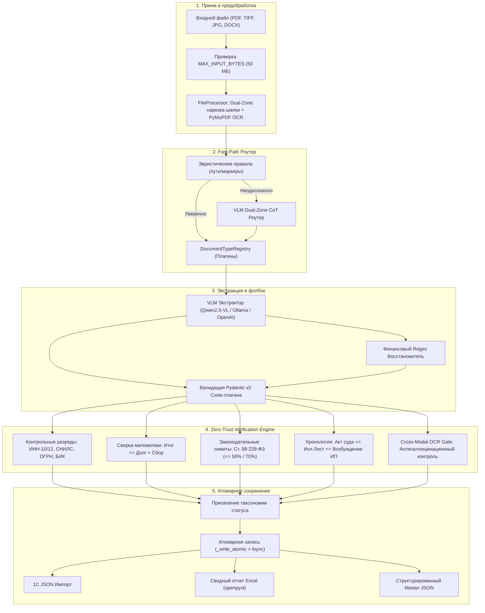

[English](ARCHITECTURE.md) | [Русский](ARCHITECTURE_RU.md)

# Архитектура и таксономия статусов

## 1. Миссия и границы системы
`ScanReader` — это библиотека и платформа распознавания юридических документов, Zero-Trust верификации и оркестрации данных, спроектированная для автоматизации юридических отделов, интеграции с 1С:Предприятие и автономных AI-агентов.

Система **не считает** вывод нейросети абсолютной истиной. Она построена на **принципе Zero-Trust («Нулевое доверие»)**:
- Быстрый визуальный классификатор Fast-Path маршрутизирует документы в специализированные плагины;
- Мультимодальная VLM-экстракция собирает структурированные поля по строгим Pydantic v2 схемам;
- Независимый детерминированный движок **Zero-Trust Verification Engine** алгоритмически проверяет математические расчеты, контрольные разряды РФ (ИНН, СНИЛС, ОГРН, БИК, банковские счета), юридическую хронологию дат и наличие сущностей в OCR-слое;
- Атомарный ввод-вывод (`_write_atomic`) исключает появление поврежденных или неполных файлов при аварийном завершении.

---

## 2. Таксономия статусов проверки

ScanReader сообщает прозрачные и однозначные статусы достоверности данных.

**Что означает `zero_trust_verified` и что не означает.** Статус выдаётся, когда
одновременно выполнены три условия:

1. прошёл хотя бы один контрольный разряд ФНС/ПФР/ЦБ (ИНН, СНИЛС, ОГРН, БИК, ключ счёта);
2. выполнена сверка денег, сравнившая **два и более числа**, и она сошлась;
3. кросс-модальный гейт выполнен — реквизиты подтверждены исходным текстом.

**Это не означает «100 %».** Статус не является формальным доказательством
правильности: он говорит, что *применимые детерминированные проверки пройдены*.
Документ может быть полным, осмысленным и при этом содержать ошибку, которую
ни одна из проверок не охватывает, — например, перепутанную сторону
переплаты или неверную привязку к делу. Автоимпорт в 1С возможен, но
предполагает, что оператор принял эту границу ответственности.

| Статус | Код | Значение и гарантии |
| :--- | :--- | :--- |
| **`zero_trust_verified`** | `ZT_VERIFIED` | Все применимые проверки пройдены: хотя бы один контрольный разряд сошёлся, денежная сверка сравнила два и более числа и сошлась, гейт подтвердил реквизиты исходным текстом. Какие именно поля проверялись — перечислено в `zero_trust.details` и в `zero_trust.details.verification_spec`. |
| **`partially_verified`** | `PARTIALLY_VERIFIED` | Часть проверок выполнена, но не все условия полной верификации наступили: либо сверка не сравнивала двух чисел, либо контрольные разряды не предъявлялись. Требует выборочного контроля. |
| **`gate_not_executed`** | `GATE_NOT_EXECUTED` | Документ передан, но эталонный текст получить не удалось, поэтому кросс-модальная сверка **не выполнялась**. Реквизиты не подтверждены исходным текстом. Автоимпорт недопустим; код возврата CLI — 3. |
| **`vlm_unverified`** | `VLM_UNVERIFIED` | Поля извлечены и прошли схему, но в документе нет ни контрольных сумм, ни составных сумм (например, простой судебный приказ). Передаётся с флагом выборочного контроля. |
| **`heuristic_fallback`** | `HEURISTIC_FALLBACK` | Модель не вернула пригодный JSON либо не вернула суммы, и они были восстановлены детерминированным regex-сканером. Список восстановленных полей — в `details.recovered_by_regex`; **эти суммы нельзя считать прочитанными с листа**. Код возврата CLI — 4. |
| **`discrepancy_detected`** | `DISCREPANCY_ERROR` | Обнаружено явное противоречие: математическая нестыковка, неверный контрольный разряд, превышение 70 % лимита удержания по ст. 99 229-ФЗ, либо реквизит, не подтверждённый исходным текстом. Помещается в карантин для ручной проверки. |
| **`ocr_low_confidence`** | `OCR_POOR_QUALITY` | Скан повреждён, размыт или имеет низкое разрешение ($< 150 \text{ DPI}$). |
| **`rejected_unsupported`** | `UNSUPPORTED_TYPE` | Документ не относится к поддерживаемым категориям. |

### Источник эталона для гейта

Кросс-модальная сверка опирается на независимый канал, и её происхождение
фиксируется в `details.gate_source` и `details.gate_independent`:

| `gate_source` | `gate_independent` | Что это |
| :--- | :--- | :--- |
| `text_layer` | `true` | Текстовый слой DOCX/TXT/PDF. Точен и ничего не стоит. |
| `ocr` | `true` | Независимый OCR-движок (`pip install "scan-reader[ocr]"`). |
| `vlm_transcription` | `false` | Транскрипция той же моделью, что и извлечение. Ошибки распознавания **неотделимы** от ошибок извлечения; при этом выдаётся предупреждение `GATE_REFERENCE_FROM_VLM`. |
| `none` | `false` | Эталон недоступен, гейт не выполнялся. |

---

## 3. Архитектура конвейера компонентов

---

## 4. Приватный интерфейс JSON-RPC 2.0 (stdio)

Модуль `scan_reader.mcp` реализует **приватный** построчный протокол JSON-RPC 2.0.
Несмотря на прежнее название раздела, это **не** официальный Model Context
Protocol: отсутствуют Content-Length framing и обязательное рукопожатие
`initialize`, поэтому клиенты MCP (Claude Code, Codex и другие) не смогут
подключиться без адаптера. Инструменты предназначены для доверенных
внутрипериметровых интеграций.

- `scan_document`: полный цикл распознавания и Zero-Trust аудита.
- `classify_document`: экспресс-роутинг шапки документа.
- `verify_legal_data`: изолированный алгоритмический аудит JSON-структур.
- `run_benchmark`: сьют эталонной оценки по Ground Truth.
- `export_results`: консолидация данных в реестры Excel и 1C.

Все инструменты применяют ограничение `MAX_INPUT_BYTES = 50 MB`, ограничивают
доступ к файлам корнями из `SCANREADER_ALLOWED_DIRS` и автоматически
маскируют чувствительные данные в логах.
