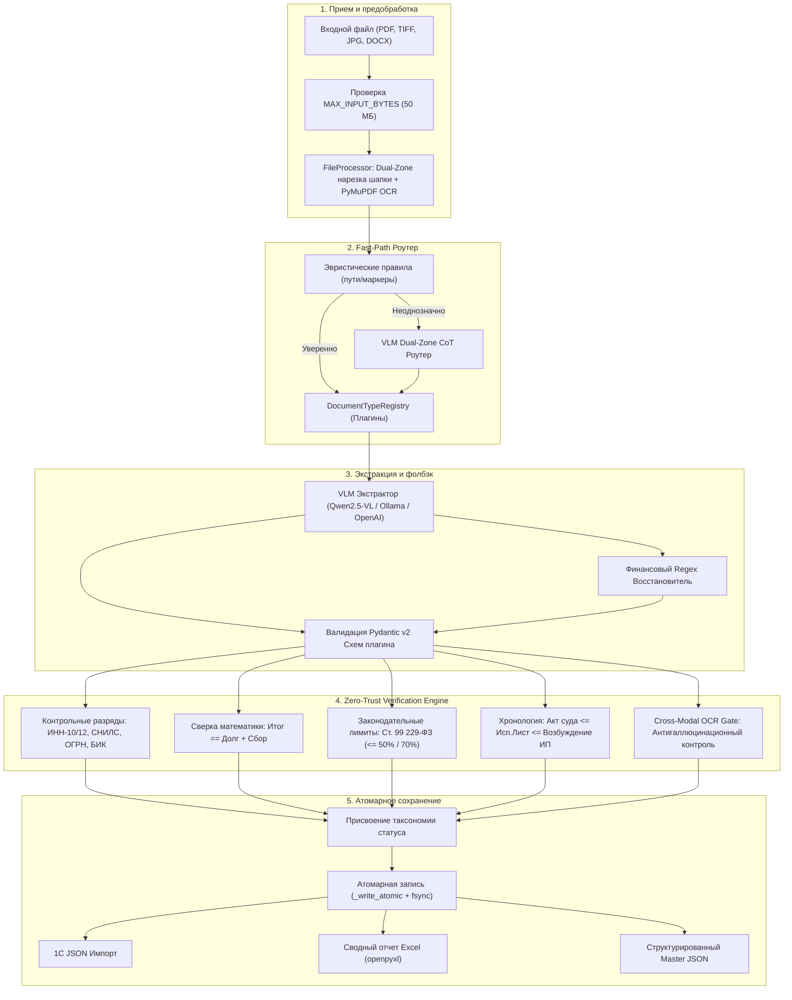

[English](ARCHITECTURE.md) | [Русский](ARCHITECTURE_RU.md)

# Архитектура и таксономия статусов

## 1. Миссия и границы системы
`ScanReader` — это библиотека и платформа распознавания юридических документов, Zero-Trust верификации и оркестрации данных, спроектированная для автоматизации юридических отделов, интеграции с 1С:Предприятие и автономных AI-агентов.

Система **не считает** вывод нейросети абсолютной истиной. Она построена на **принципе Zero-Trust («Нулевое доверие»)**:
- Быстрый визуальный классификатор Fast-Path маршрутизирует документы в специализированные плагины;
- Мультимодальная VLM-экстракция собирает структурированные поля по строгим Pydantic v2 схемам;
- Независимый детерминированный движок **Zero-Trust Verification Engine** алгоритмически проверяет математические расчеты, контрольные разряды РФ (ИНН, СНИЛС, ОГРН, БИК, банковские счета), юридическую хронологию дат и наличие сущностей в OCR-слое;
- Атомарный ввод-вывод (`_write_atomic`) исключает появление поврежденных или неполных файлов при аварийном завершении.

---

## 2. Таксономия статусов проверки

ScanReader сообщает прозрачные и однозначные статусы достоверности данных:

| Статус | Код | Значение и гарантии |
| :--- | :--- | :--- |
| **`zero_trust_verified`** | `ZT_VERIFIED` | 100% подтвержденная достоверность: математика сошлась ($\text{долг} + \text{сбор} = \text{итог}$), контрольные разряды ИНН/СНИЛС/ОГРН верны, даты согласованы, сущности подтверждены OCR. Документ готов к безоговорочному автоимпорту в 1С. |
| **`vlm_unverified`** | `VLM_UNVERIFIED` | Поля извлечены и валидны по Pydantic-схеме, но в документе отсутствуют детализированные расчеты или контрольные суммы (например, простой судебный приказ). Передается с флагом выборочного контроля. |
| **`heuristic_fallback`** | `HEURISTIC_FALLBACK` | Нейросеть сгенерировала некорректный JSON или превысила таймаут; сработал детерминированный аварийный regex-сканер сумм и номеров. |
| **`discrepancy_detected`** | `DISCREPANCY_ERROR` | Обнаружено явное противоречие: математическая нестыковка, неверный контрольный разряд ИНН или превышение 70% лимита удержания по ст. 99 229-ФЗ. Помещается в карантин для ручной проверки. |
| **`ocr_low_confidence`** | `OCR_POOR_QUALITY` | Скан поврежден, размыт или имеет низкое разрешение ($< 150 \text{ DPI}$ или уверенность OCR $< 0.6$). |
| **`rejected_unsupported`** | `UNSUPPORTED_TYPE` | Документ не относится к поддерживаемым категориям исполнительного производства. |

---

## 3. Архитектура конвейера компонентов

---

## 4. Интерфейс Model Context Protocol (MCP)

Модуль `scan_reader.mcp` реализует стандартные инструменты JSON-RPC 2.0 / MCP Stdio:
- `scan_document`: полный цикл распознавания и Zero-Trust аудита.
- `classify_document`: экспресс-роутинг шапки документа.
- `verify_legal_data`: изолированный алгоритмический аудит JSON-структур.
- `run_benchmark`: сьют эталонной оценки по Ground Truth.
- `export_results`: консолидация данных в реестры Excel и 1C.

Все инструменты применяют ограничение `MAX_INPUT_BYTES = 50 MB` и автоматически маскируют чувствительные данные в логах.
