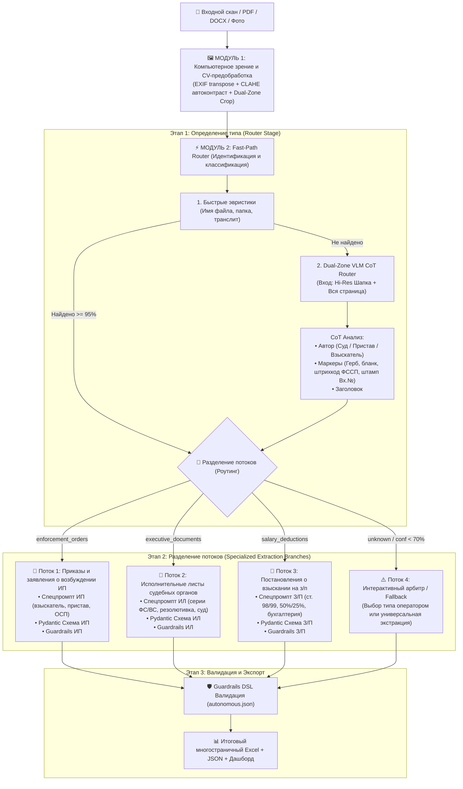

# 🏆 Единый план максимальной точности распознавания: Роутинг + CV + Dual-Zone
## Архитектурный регламент конвейера классификации и извлечения данных (Версия 7)

---

## 1. Архитектура сквозного конвейера (End-to-End Pipeline)

---

## 2. Ключевые компоненты максимальной точности

### 📸 Компонент 1: Предобработка компьютерным зрением (CV Ingestion)
- **CLAHE (Contrast Limited Adaptive Histogram Equalization):** адаптивное локальное выравнивание контраста в `file_processor.py`. Усиливает бледные печати, штампы и мелкий шрифт на серых/шумных сканах.
- **Dual-Zone Slicing (Двухзональная нарезка):**
  - `Zone 1 (Header Crop)`: верхние 35% страницы в максимальном разрешении (без сжатия), где расположены все ключевые идентификаторы документа.
  - `Zone 2 (Full Page Thumbnail)`: вся страница с Lanczos-сглаживанием для оценки общей геометрии.

### ⚡ Компонент 2: Fast-Path Router с Chain-of-Thought (Этап 1)
- Модель выполняет **только одну задачу** — определение типа документа.
- Структурированный CoT-анализ:
  1. `issuing_authority`: Кто издал документ?
  2. `visual_anchors`: Наличие герба, серии бланка, штрихкода ФССП, входящего штампа.
  3. `document_title`: Точный заголовок.
  4. `doc_type`: Результирующий тип с оценкой достоверности `confidence`.

### 🌿 Компонент 3: Динамическое разделение потоков экстракции (Этап 2)
- Каждый тип документа обрабатывается **своим изолированным плагином** в `doc_types/<type_id>/`.
- Промпт не содержит посторонних инструкций от других типов документов $\rightarrow$ отсутствие взаимного влияния и галлюцинаций.

### 🛡️ Компонент 4: Guardrails и Арбитраж (Этап 3)
- Проверка полноты и корректности реквизитов через `autonomous.json`.
- Интерактивный диалог в `launcher.py`, если достоверность классификации $< 70\%$.

---

## 3. Матрица прогноза точности

| Этап конвейера | Точность ДО | Точность ПОСЛЕ | Ключевой фактор роста |
|---|---|---|---|
| **Классификация сканов** | **67%** | **89–94%+** | Dual-Zone Header Crop + CoT-роутер + CLAHE |
| **Извлечение полей и сумм** | **72%** | **92–96%+** | Изолированные потоки со специализированными промптами |
| **Устойчивость к сбоям** | Средняя | **100% (Zero Crashes)** | Graceful Fallback + Арбитраж |
